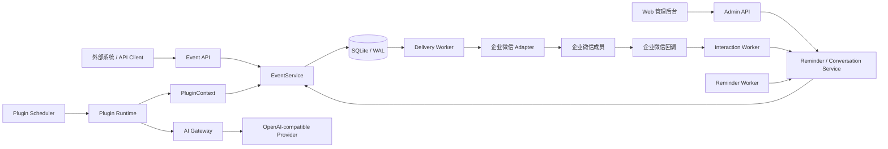

> [!IMPORTANT]
> **Vibe Coding 说明 / Disclaimer**
>
> 本仓库是作者在 AI 辅助下以 **vibe coding** 方式完成的个人作品：主要通过自然语言描述需求、由 AI 生成和修改代码，作者负责产品想法、体验验证和方向取舍。作者不是专业开发者，也不具备系统的代码审计能力；代码按现状提供，请在使用、部署或二次开发前自行审查、测试并承担相应风险。

<p align="center">
  
</p>

<h1 align="center">Notify Hub 企业微信通知与提醒中心</h1>

<p align="center">
  <a href="https://github.com/VirgoooooX/Notify-Hub">
    
  </a>
  <a href="https://www.python.org/">
    
  </a>
  <a href="https://fastapi.tiangolo.com/">
    
  </a>
  <a href="https://vuejs.org/">
    
  </a>
  <a href="LICENSE">
    
  </a>
</p>

> **Notify Hub** 是一个面向个人、家庭和小型自托管环境的企业微信通知与提醒平台。
>
> 它将外部事件、监控插件、AI 内容判定、单次与周期提醒、持续催办和企业微信投递收敛到一个可审计、可恢复的可靠消息链路中，并保持单容器、单数据库的轻量部署体验。

---

## 🌟 核心能力

- 📬 **可靠事件与投递队列**
  Event、Notification、Delivery 三层模型先持久化、后发送。API 返回 `202 Accepted` 时平台已经接管事件，服务重启后仍可继续投递。

- ♻️ **端到端幂等与故障恢复**
  来源提供稳定 `event_key`，数据库唯一约束负责最终兜底；Delivery 使用租约、心跳、失败退避与过期 claim 回收，降低重复发送和消息丢失风险。

- 💬 **企业微信双向集成**
  支持指定 UserID 的文字、图文、图片和语音投递，回调验签解密、Token 缓存、临时媒体上传，以及应用底部菜单中的提醒快捷操作。

- ⏰ **完整提醒与持续催办**
  支持 Once、Interval、Cron 调度，提醒定义与执行实例分离；可按接收人记录确认状态、重复催办、推迟、今日忽略、停止本次和完成结果。

- 📣 **受控广播提醒**
  仅 Web 管理员可以创建 `@all` 广播。交互式广播冻结成员快照，首次使用企业微信原生广播，后续只催办仍未完成的成员。

- 🧩 **受控插件运行时**
  插件通过 Manifest 声明网络、Secret、媒体、AI 和广播权限，只能使用 `PluginContext` 发出标准事件，不能直接访问企业微信渠道或业务数据库。

- 🧠 **AI Gateway**
  平台统一管理 Provider、模型允许列表、Profile、API Key、预算、缓存和调用审计。插件只能调用已授权且能力匹配的 Profile，无法读取明文密钥或自行指定远端模型。

- 🖼️ **安全媒体处理**
  图片与语音具有类型、尺寸、时长、下载跳转和 SSRF 边界；媒体资产统一入库、签名访问、引用保护并由后台任务进行有界清理。

- 🖥️ **一体化管理后台**
  提供运行概览、通知与投递、接收人、API Client、插件、AI Provider/Profile、提醒中心和系统设置等管理页面，并包含面向企业微信成员的移动提醒页面。

---

## 🏗️ 系统架构

Notify Hub 采用**模块化单体**。API、Worker、插件运行时、企业微信适配器和前端静态资源共同打包进一个镜像，SQLite 是所有可恢复任务的事实来源。



核心边界：

- API 路由只处理认证、校验、服务调用和 HTTP 响应映射；
- 插件只发现事件，不直接发送企业微信消息；
- 外部网络请求不放在数据库事务中；
- Reminder、Plugin、Delivery 和 Interaction 状态均可从数据库恢复；
- SQLite 部署只允许一个应用实例写入同一数据库。

---

## 🔌 内置监控插件

| 插件 | 用途 | 默认调度 | 能力 |
| --- | --- | --- | --- |
| `codex_x_monitor` | 监控指定 X 账号中的 Codex 用量重置消息 | 工作时段每 10 分钟 | X 数据源、AI 分类、可靠游标 |
| `fabrizio_hwg_monitor` | 识别 Fabrizio Romano 的 “HERE WE GO” 转会消息 | 每 3 分钟 | X 数据源、媒体写入、规则匹配 |

插件均包含 Manifest、配置模型、固定测试数据和单元测试。管理员可以在后台配置普通字段、独立 Secret、接收人、AI Profile 与调度规则。

---

## ⏰ 提醒中心

提醒中心将“长期定义”和“某一次实际执行”分开建模：

- `Reminder` 保存标题、内容、调度、接收人和长期状态；
- `ReminderOccurrence` 表示某个计划时间产生的一次执行实例；
- `ReminderOccurrenceRecipient` 保存每位接收人的确认、催办次数和下次通知时间；
- Planner 只创建持久化实例，Escalation 流程通过数据库 claim 产生 Event；
- 只有 Event 被接受或判定为重复后，系统才推进通知次数；
- 企业微信菜单操作始终按 UserID 作用于最近一次成功投递的交互式提醒。

管理员后台支持查看提醒详情、执行时间线、接收人状态和投递结果；企业微信成员可通过签名移动页面查看和管理自己的提醒。

---

## 📂 项目结构

```text
notify-hub/
├── assets/                         # 品牌资产与正式 Logo
│   └── brand/
│       ├── png/                    # README、文档和常规界面使用
│       ├── svg/                    # 正式矢量源文件
│       └── source/                 # 选稿过程文件
├── backend/
│   ├── app/
│   │   ├── ai/                     # AI Provider 协议、Schema 与 Gateway
│   │   ├── api/                    # Admin、Client、回调、媒体与移动端 API
│   │   ├── application/            # Event、Reminder、Plugin 等应用服务
│   │   ├── channels/wecom/         # 企业微信客户端、加解密与渠道适配器
│   │   ├── domain/                 # 时钟、提醒草稿、调度与领域状态
│   │   ├── infrastructure/         # 数据库、日志、安全与 SecretStore
│   │   ├── media/                  # 下载、校验、处理、存储与语音适配
│   │   ├── plugin_runtime/         # Manifest、Context、Registry 与 Runner
│   │   ├── workers/                # Delivery、Reminder、Plugin 等 Worker
│   │   └── main.py                 # FastAPI 应用工厂与生命周期装配
│   ├── migrations/                 # Alembic 数据库迁移
│   └── tests/                      # 后端契约、领域、安全与可靠性测试
├── frontend/
│   ├── public/brand/               # 前端使用的品牌矢量资源
│   ├── src/
│   │   ├── components/             # 数据展示、反馈、布局与 UI 原子组件
│   │   ├── features/plugins/       # 插件配置功能切片
│   │   ├── views/                  # 管理后台和移动提醒页面
│   │   ├── stores/                 # Pinia 状态
│   │   └── styles/                 # Design Tokens 与语义样式系统
│   └── tests/                      # Vitest 前端测试
├── plugins/
│   ├── builtin/                    # 仓库内置可信插件
│   ├── private/                    # 管理员手工部署的私有插件
│   └── shared/                     # 插件共享的数据源与媒体能力
├── deploy/                         # Dockerfile、Compose 与容器入口
├── docs/                           # 架构、领域、API、安全、运维与 ADR
├── scripts/                        # 开发启动、发布及维护脚本
├── pyproject.toml                  # Python 依赖与质量工具配置
└── README.md
```

---

## 🚀 Docker 部署

### 1. 准备配置

```bash
git clone https://github.com/VirgoooooX/Notify-Hub.git
cd Notify-Hub
cp .env.example .env
```

编辑 `.env`，至少配置：

```ini
NOTIFY_HUB_PUBLIC_BASE_URL=https://notify.example.com
NOTIFY_HUB_SECRET_ENCRYPTION_KEY=replace-with-a-strong-random-key
NOTIFY_HUB_JWT_SECRET=replace-with-another-strong-random-key
NOTIFY_HUB_PUBLIC_MEDIA_SIGNING_KEY=replace-with-a-public-media-signing-key

NOTIFY_HUB_WECOM_CORP_ID=wwxxxxxxxxxxxxxxxx
NOTIFY_HUB_WECOM_AGENT_ID=1000002
NOTIFY_HUB_WECOM_SECRET=replace-with-wecom-app-secret
```

生产环境中的主加密密钥、JWT Secret 和公开媒体签名密钥必须至少 32 个字符。真实 `.env` 不得提交到版本库。

> [!NOTE]
> 应用生产模式要求 `NOTIFY_HUB_PUBLIC_MEDIA_SIGNING_KEY`。部署前请确认 Compose 的 `environment` 已透传该变量；当前配置模型不会接受内置开发值用于生产环境。

### 2. 启动服务

```bash
docker compose -f deploy/docker-compose.yml config --quiet
docker compose -f deploy/docker-compose.yml pull
docker compose -f deploy/docker-compose.yml up -d
```

Compose 默认将服务绑定到 `127.0.0.1:8788`，建议通过 HTTPS 反向代理对外提供服务。容器启动前会自动执行 `alembic upgrade head`。

### 3. 初始化管理员

```bash
docker compose -f deploy/docker-compose.yml exec notify-hub \
  python -m app.cli.reset_admin_password --username admin
```

### 4. 检查状态

```bash
curl --fail http://127.0.0.1:8788/health/live
curl --fail http://127.0.0.1:8788/health/ready
docker compose -f deploy/docker-compose.yml logs -f --tail 200
```

> [!IMPORTANT]
> Notify Hub 当前使用 SQLite。不要同时运行两个连接同一数据库的容器副本，也不要在应用运行时直接覆盖数据库文件。

---

## 🛠️ Windows 本地开发

### 环境要求

- Python `>= 3.12, < 3.13`
- Node.js 22
- npm 10+
- PowerShell 7 或 Windows PowerShell 5.1

### 一键启动

```powershell
.\scripts\start-dev.ps1
```

脚本会同步后端与前端依赖、执行 Alembic 迁移，并分别启动：

- 管理后台：`http://127.0.0.1:5173`
- 后端 API：`http://127.0.0.1:8000`
- OpenAPI：`http://127.0.0.1:8000/docs`

常用参数：

```powershell
# 不自动打开浏览器
.\scripts\start-dev.ps1 -NoBrowser

# 允许局域网访问
.\scripts\start-dev.ps1 -Lan

# 仅启动单个服务
.\scripts\start-dev.ps1 -Service backend
.\scripts\start-dev.ps1 -Service frontend
```

首次创建或重置管理员密码：

```powershell
.\.venv\Scripts\python.exe -m app.cli.reset_admin_password --username admin
```

---

## 🧪 质量门禁

```powershell
# Python 格式、静态检查与测试
.\.venv\Scripts\ruff.exe format --check backend plugins
.\.venv\Scripts\ruff.exe check backend plugins
.\.venv\Scripts\mypy.exe backend/app plugins
.\.venv\Scripts\pytest.exe

# Vue / TypeScript
Set-Location frontend
npm run lint
npm run typecheck
npm run test
npm run build
```

测试覆盖事件幂等、数据库约束、Delivery 重试与租约、提醒状态转换、插件隔离、AI Gateway、企业微信加解密、媒体安全、回调重放和服务重启恢复等关键边界。

---

## 🛡️ 安全与可靠性

> [!IMPORTANT]
> **Secret 不回显**
>
> 企业微信 Secret、插件 Cookie、AI API Key 等敏感配置由环境变量或加密 SecretStore 管理。管理 API 只返回“是否已配置”和来源，不返回明文。

> [!TIP]
> **最小权限插件**
>
> 插件必须在 Manifest 中声明网络域名、Secret 名称、AI 能力、媒体写入和广播权限。插件无法获得企业微信 Token，也不能访问 ORM Session 或业务表。

> [!WARNING]
> **单实例 SQLite**
>
> WAL、busy timeout 和短事务提高了单实例可靠性，但不构成多实例协调机制。需要高可用或高并发写入时，应先迁移 PostgreSQL，再拆分 API、Worker 和 Scheduler。

其他保护包括：

- 管理员身份与 API Client 身份完全分离；
- 管理员密码使用 Argon2 哈希；
- Access Token、Refresh Token、移动端签名和公开媒体 URL 分用途签名；
- 企业微信回调先验签解密，再持久化并异步处理；
- 外部 HTTP 请求具有连接/总超时、地址校验和稳定错误归一化；
- 日志不记录 Secret、Access Token、完整回调 XML 或敏感正文；
- 广播、手工重试、配置更新和维护操作进入审计记录。

---

## 📚 文档索引

| 文档 | 内容 |
| --- | --- |
| [`PROJECT_GUIDE.md`](PROJECT_GUIDE.md) | 当前架构、领域、安全、插件和测试总纲 |
| [`docs/DECISIONS.md`](docs/DECISIONS.md) | 已接受的架构决策及其原因 |
| [`docs/operations.md`](docs/operations.md) | 部署、备份、恢复和提醒运维 |
| [`docs/project-log.md`](docs/project-log.md) | 按主题记录、日期精确到天的功能进展、优化和 Debug 复盘 |
| [`docs/archive/design-phase/`](docs/archive/design-phase/) | 历史设计与开发计划，仅供追溯 |

---

## 🚧 产品边界

Notify Hub 专注于“发现事件并可靠通知”，当前明确不做：

- 多租户商业 SaaS、计费和组织隔离；
- Home Assistant、n8n 或通用可视化工作流的替代品；
- 在线上传并立即执行任意 Python 包或脚本；
- 允许 LLM 直接修改数据库、执行系统命令或决定幂等语义；
- 为尚未出现的扩展需求提前引入 Redis、RabbitMQ 或微服务；
- 在 SQLite 模式下运行共享同一数据库的多个应用副本。

---

## 📄 开源许可

Notify Hub 基于 [GNU Affero General Public License v3.0](LICENSE) 开源。

如果你修改本项目并通过网络向用户提供服务，需要按照 AGPL-3.0 的要求向这些用户提供对应修改版本的完整源代码。
