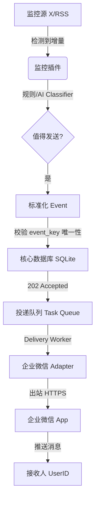

# Notify Hub

> **面向个人与家庭场景的自托管企业微信通知、提醒与 AI 监控插件平台**

<div align="center">

[](https://github.com/VirgoooooX/Notify-Hub)
[](https://www.python.org/)
[](https://vuejs.org/)
[](https://www.docker.com/)
[](./LICENSE)

</div>

Notify Hub 是一个采用**模块化单体**（Modular Monolith）架构的轻量化自托管通知中心。它旨在将散落的监控源、提醒事项、AI 语义判定及企业微信投递，聚合在同一个安全自治的部署单元中。

---

## 目录

- [一、项目定位](#一项目定位)
- [二、核心特性](#二核心特性)
- [三、架构与流转逻辑](#三架构与流转逻辑)
- [四、目录结构索引](#四目录结构索引)
- [五、本地开发与测试](#五本地开发与测试)
- [六、Docker 生产部署](#六docker-生产部署)
- [七、数据安全与网络边界](#七数据安全与网络边界)
- [八、开发路线图与非目标](#八开发路线图与非目标)
- [九、开源许可](#九开源许可)

---

## 一、项目定位

* **核心平台**：负责敏感凭据隔离、外部事件接收、消息去重、任务调度、优先级投递及失败重试。
* **监控插件**：作为相对隔离的子模块，连接推特、RSS 等特定数据源，判定增量变化并向核心提交标准化事件。
* **AI 决策网关**：统一维护 LLM API 凭据、运行 Profile、Token 预算及持久化缓存。插件仅通过 Manifest 授权的 Profile 接口进行低成本判定。

> [!IMPORTANT]
> **代码隔离原则**：
> 监控插件无权读取企业微信 Token 或 API 密钥，亦不能直接绕过平台执行出站网络请求或数据库写入。

---

## 二、核心特性

1. **可靠投递**：采用“先落库再投递”的队列机制，确保消息即使网络波动也绝不丢失。
2. **端到端幂等**：基于 `event_key` 和全局唯一约束，从源头过滤重复事件。
3. **AI 辅助网关**：利用 LLM 语义模式（AI Profiles）进行推文/消息分类、预筛选和摘要，防止频繁触发无效通知。
4. **轻量自研 UI**：拒绝臃肿的第三方 UI 框架，基于原生 CSS Design Tokens 构建极致响应、防泄露的现代化后台。
5. **部署极其简单**：单镜像、单容器、内置 SQLite 与 Alembic，没有 Redis 或 RabbitMQ 等复杂基础设施负担。

---

## 三、架构与流转逻辑

### 3.1 消息流转链路

以下是事件从外部监控源到投递至企业微信成员的完整生命周期：



### 3.2 AI 网关调用契约

插件必须通过安全的 `context.ai` 代理，无权获取明文 API 密钥与远端模型直连地址：

```mermaid
sequenceDiagram
    participant P as Plugin Runtime
    participant C as AI Gateway (Core)
    participant E as Database (Cache)
    participant A as LLM Provider (Remote)
    
    P->>C: context.ai.classify(profile_id, content)
    C->>C: 验证 Profile 授权状态与每日预算
    alt 缓存命中 (Cache Hit)
        C->>E: 查询最近缓存 (TTL)
        E-->>C: 返回历史判定结果
        C-->>P: 返回结果
    else 缓存未命中 (Cache Miss)
        C->>A: 携带 API Key 调用 (带 Timeout)
        A-->>C: 返回结构化 JSON
        C->>E: 写入持久化缓存
        C-->>P: 返回结果
    </div>
```

---

## 四、目录结构索引

```text
.
├── backend/                 # 后端 Python 应用 (FastAPI)
│   ├── app/
│   │   ├── api/             # 路由与控制器 (管理接口与 Client 接口分离)
│   │   ├── core/            # 核心机制 (加密、调度、任务队列、AI 网关)
│   │   ├── db/              # SQLAlchemy 数据库模型与 Alembic 配置
│   │   ├── domain/          # 领域边界 (通知、提醒、接收人实体逻辑)
│   │   └── services/        # 业务逻辑服务 (微信投递、AI 请求、安全机制)
│   └── alembic/             # 数据库结构演进迁移脚本
├── frontend/                # 前端 Vue 3 单页应用
│   ├── src/
│   │   ├── components/      # 重用展示及控制层包装组件
│   │   ├── features/        # 功能切片组件 (插件、AI 管理面板)
│   │   ├── styles/          # 模块化 CSS 设计系统 (Tokens, Reset, Semantic)
│   │   └── views/           # 后台主页面 (工作台、提醒、消息、设置)
│   └── tests/               # 前端 Vitest 单元测试
├── plugins/                 # 核心内置插件模块 (如 Codex X Monitor)
├── deploy/                  # Docker 容器化构建与部署脚本
├── data/                    # 本地持久化挂载数据存储 (SQLite/Media/Logs)
├── scripts/                 # 本地多平台一键开发运行脚本
├── README.md                # 本文档
└── pyproject.toml           # 依赖定义与打包配置文件
```

---

## 五、本地开发与测试

### 5.1 环境要求
* 后端：Python 3.12+ (不推荐 3.13+)
* 前端：Node.js 22+ & npm 10+

### 5.2 极速一键启动 (推荐)

在 Windows 系统的 PowerShell 中，可以直接运行：
```powershell
.\scripts\start-dev.ps1
```
该脚本会自动创建 Python 虚拟环境 `.venv`、安装前后端依赖、执行 SQLite 迁移、监听本地端口并打开浏览器 `http://127.0.0.1:5173`。

* **只运行服务，不自动打开浏览器**：
  ```powershell
  .\scripts\start-dev.ps1 -NoBrowser
  ```
* **允许同局域网内其他设备访问 (监听 0.0.0.0)**：
  ```powershell
  .\scripts\start-dev.ps1 -Lan
  ```
* **绑定反向代理自定义测试域名**：
  ```powershell
  .\scripts\start-dev.ps1 -Lan -AllowedHosts notify.example.com
  ```

### 5.3 管理员账号初始化

首次运行服务，需在本地命令行重置或创建你的管理员密码（至少 12 位）：
```powershell
.\.venv\Scripts\python.exe -m app.cli.reset_admin_password --username admin
```

### 5.4 手动按步骤开发

如果希望手动控制，请在不同终端窗口依次执行：

**后端服务：**
```powershell
python -m venv .venv
.\.venv\Scripts\python.exe -m pip install -e ".[dev]"
.\.venv\Scripts\python.exe -m alembic -c backend\alembic.ini upgrade head
.\.venv\Scripts\python.exe -m uvicorn app.main:app --app-dir backend --reload
```

**前端服务：**
```powershell
cd frontend
npm ci
npm run dev
```

### 5.5 本地质量门禁与测试

在提交代码前，请确保以下自动化校验全部通过：

```powershell
# 1. 后端 Ruff 格式化与静态检查
.\.venv\Scripts\ruff.exe format --check backend plugins
.\.venv\Scripts\ruff.exe check backend plugins
.\.venv\Scripts\mypy.exe backend/app plugins

# 2. 后端 Pytest 测试
.\.venv\Scripts\pytest.exe

# 3. 前端测试与打包
cd frontend
npm run lint
npm run typecheck
npm run test
npm run build
```

---

## 六、Docker 生产部署

Notify Hub 采用单镜像部署。在生产环境中，**请确保只运行一个容器副本**以防止 SQLite 并发写入冲突。

### 6.1 配置环境变量

复制并修改本地配置，在仓库根目录新建 `.env` 文件（已默认加入 `.gitignore`）：

```ini
# 基础配置
NOTIFY_HUB_PUBLIC_BASE_URL=https://notify.yourdomain.com
NOTIFY_HUB_SECRET_ENCRYPTION_KEY=your-32-byte-hex-encryption-key
NOTIFY_HUB_JWT_SECRET=your-secure-jwt-secret-string

# 企业微信出站配置
NOTIFY_HUB_WECOM_CORP_ID=ww123456789abc
NOTIFY_HUB_WECOM_AGENT_ID=1000002
NOTIFY_HUB_WECOM_SECRET=wecom-application-secret
NOTIFY_HUB_WECOM_CALLBACK_TOKEN=callback-token-defined-in-wecom
NOTIFY_HUB_WECOM_CALLBACK_AES_KEY=callback-aes-key-defined-in-wecom
```

### 6.2 容器一键启动

从仓库根目录构建镜像并后台启动：

```bash
# 校验 Compose 配置
docker compose -f deploy/docker-compose.yml config --quiet

# 构建与运行
docker compose -f deploy/docker-compose.yml build
docker compose -f deploy/docker-compose.yml up -d
```

### 6.3 运维常用命令

* **查看日志**：
  ```bash
  docker compose -f deploy/docker-compose.yml logs -f --tail 200
  ```
* **手动触发迁移**：
  ```bash
  docker compose -f deploy/docker-compose.yml run --rm notify-hub migrate
  ```

---

## 七、数据安全与网络边界

* **凭据机密防护**：敏感设置（如 API Key）在 SQLite 数据库中经过 `AES-256-GCM` 进行字段级加密存储，密钥派生于宿主机环境变量 `NOTIFY_HUB_SECRET_ENCRYPTION_KEY`。
* **安全网络约束**：除非显式启用“允许私网端点”，否则 AI Provider 出站网络请求只允许连通公网，防止服务端请求伪造（SSRF）对局域网其他服务发起攻击。
* **自建 HTTPS 代理**：若企业微信 API 或 OpenAI 请求需要通过中转，可在 `Settings` 中独立指定出站 proxy 地址，保障核心通道机密安全性。

---

## 八、开发路线图与非目标

### 8.1 规划中特性 (Roadmap)
* **v0.7.x**：接入企业微信交互卡片回调，点击按钮可直接延后、取消或完成特定提醒。
* **v0.8.x**：支持语音投递与回调接收，提供本地 ASR/TTS 插件适配。

### 8.2 非目标 (Non-Goals)
* 不提供无界多租户 SaaS 托管服务。
* 不允许在后台上传、在线修改或任意执行不可信的 Python 脚本。
* 核心平台不依赖 Redis、RabbitMQ 等多节点服务，始终保持简单的单机部署能力。

---

## 九、开源许可

本项目基于 **[GNU Affero General Public License v3.0 (AGPL-3.0)](./LICENSE)** 协议开源。凡是通过网络与该服务交互的修改版，均必须向社区公开其修改版的完整源代码。
